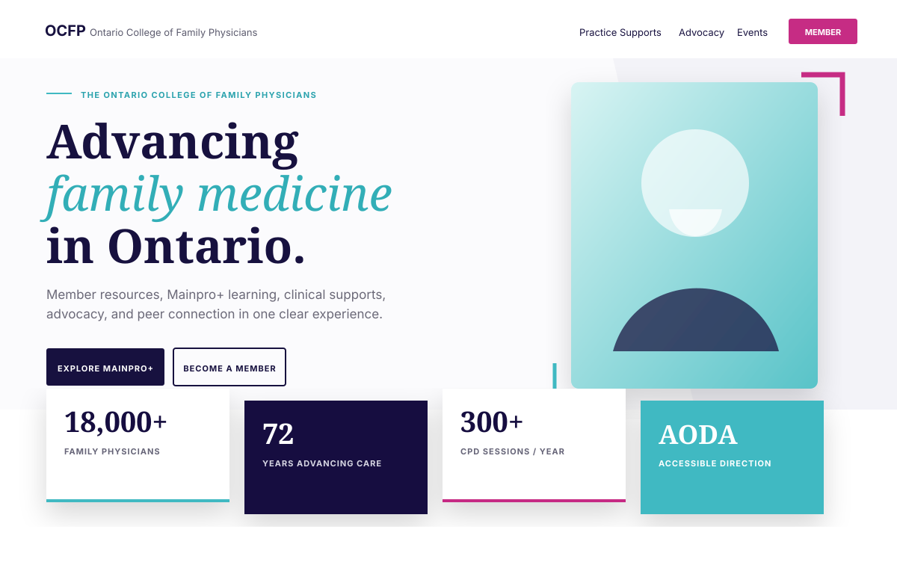
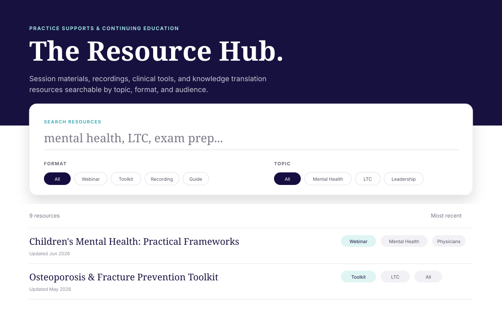
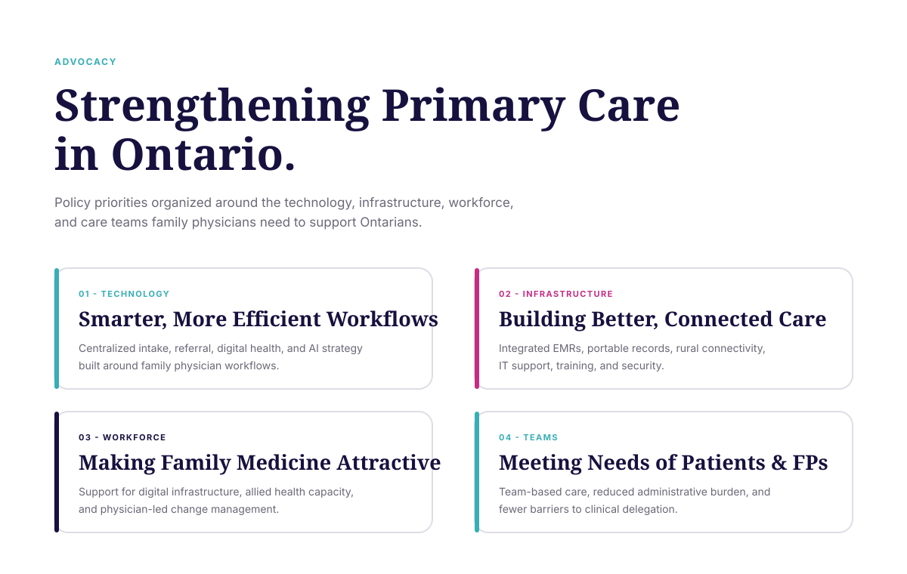
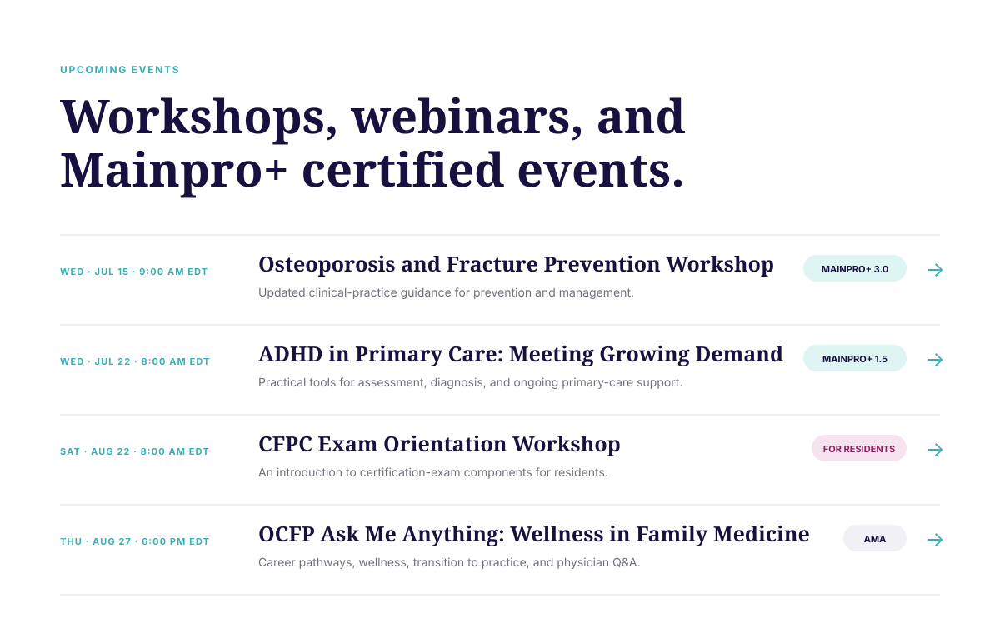

# Ontario College of Family Physicians Website Redesign

**A responsive healthcare-association website concept focused on member resources, professional learning, advocacy, events, and clear physician-facing information architecture.**

This project is an independent portfolio redesign concept for the **Ontario College of Family Physicians (OCFP)**. It explores how a professional healthcare association can organize a large amount of member-facing content into clearer pathways for clinical resources, continuing professional development, advocacy, leadership, events, and organizational updates.

**[View the live demo](https://kyla-zeit.github.io/ontario-college-of-family-physicians/)**

> **Portfolio concept:** This repository is not affiliated with, endorsed by, or maintained by the Ontario College of Family Physicians. It is a front-end redesign prototype created for portfolio demonstration. Content in the prototype reflects the project source and is not presented here as an official or current OCFP publication.

## Product preview

<p align="center">
  
  &nbsp;
  
</p>

<p align="center">
  <strong>Homepage</strong>: member-focused navigation, professional-learning calls to action, current topics, and organization-level content.<br/>
  <strong>Resource Hub</strong>: searchable and filterable practice supports organized by format, topic, audience, and recency.
</p>

<p align="center">
  
  &nbsp;
  
</p>

<p align="center">
  <strong>Advocacy</strong>: structured policy priorities across technology, infrastructure, workforce, and team-based care.<br/>
  <strong>Events</strong>: scannable professional-learning listings with dates, descriptions, and Mainpro+ context.
</p>

> The portfolio previews above are source-faithful visualizations based directly on the current React routes, labels, information hierarchy, and navy / teal / magenta design system. The live GitHub Pages build is the authoritative interactive demo.

## Project at a glance

| Area | Implementation |
| --- | --- |
| Frontend | React 19 + TypeScript |
| Build tooling | Vite 8 |
| Routing | TanStack Router |
| Styling | Tailwind CSS 4 + custom design tokens |
| UI primitives | Radix UI / reusable component layer |
| Client utilities | TanStack React Query, React Hook Form, Zod |
| Deployment | GitHub Pages via GitHub Actions |
| Primary experience | Multi-page physician-association website concept |

## The design problem

A professional medical association website has to serve several different intents without making members excavate a giant navigation tree every time they need one resource.

The redesign organizes those needs into clearer pathways:

```text
Family Physician / Resident / Member
                │
                ├── Needs a clinical or practice resource
                │        ↓
                │   Practice Supports
                │        ↓
                │   Search + Filter Resource Hub
                │
                ├── Needs professional learning
                │        ↓
                │   Events / Mainpro+ content
                │
                ├── Wants policy updates
                │        ↓
                │   Advocacy / News
                │
                └── Wants College context
                         ↓
                  About / Leadership / Connect
```

The result is a content architecture that prioritizes **findability, scannability, and professional relevance** over a long undifferentiated list of organizational pages.

## Core experience

### Member-focused homepage

The homepage acts as a dashboard-like entry point rather than a conventional institutional landing page.

It includes:

- A large editorial hero focused on family medicine in Ontario
- Direct calls to action for professional learning and membership information
- Floating organization / professional-development statistics
- A prominent "Hot Topics" section for current clinical, practice, and advocacy content
- President / leadership messaging
- A tabbed content area for Events, Resources, News, and Mainpro+
- Resource and update cards designed for rapid scanning

The visual hierarchy uses large serif headlines for editorial emphasis while preserving a restrained information-dense layout for professional content.

### Searchable Resource Hub

The `/practice-supports` route is one of the strongest interaction-focused areas of the concept.

Users can:

- Search resource titles
- Filter by content format
- Filter by topic
- Review resource audience and update date
- Browse related practice-support programs

Current resource formats represented in the interface include webinars, toolkits, recordings, slides, and guides. Topic filters include mental health, long-term care, health equity, leadership, exam preparation, and wellness.

The interaction remains client-side and immediate, demonstrating how a larger production resource library could be structured before connecting it to a CMS or external content service.

### Advocacy architecture

The `/advocacy` route turns broad policy messaging into four clearly separated priority areas:

1. **Technology**: digital health, referral workflows, AI strategy, and physician-centred tooling
2. **Infrastructure**: EMR integration, connectivity, IT support, security, and system interoperability
3. **Workforce**: physician recruitment / retention context and implementation support
4. **Teams**: team-based care, administrative burden, clinical support, and delegation barriers

Each area uses a consistent campaign-card structure, allowing longer policy content to remain approachable without flattening everything into identical text blocks.

### Events and professional learning

The `/events` route presents workshops and webinars in a compact chronological format.

Each listing includes:

- Date and time
- Event title
- Short description
- Mainpro+ or audience context where applicable
- A clear directional action affordance

The layout is intentionally more like a professional schedule than a consumer event-card grid, which better matches the audience and content density.

### Leadership, news, and organizational content

Additional routes provide room for broader institutional content without crowding the core member journey:

- `/about`
- `/leadership`
- `/news`
- `/connect`

This separation keeps the homepage useful as a discovery layer while allowing deeper organizational material to live in dedicated contexts.

## Information architecture

| Route | Purpose |
| --- | --- |
| `/` | Homepage, current topics, professional-learning discovery |
| `/practice-supports` | Searchable professional and clinical Resource Hub |
| `/advocacy` | Policy priorities and advocacy messaging |
| `/events` | Workshops, webinars, and Mainpro+ event listings |
| `/news` | College updates and physician-facing news |
| `/leadership` | Leadership content and organizational context |
| `/about` | About the College concept content |
| `/connect` | Contact and member-engagement pathway |

TanStack Router provides the route structure, and major routes define page metadata for titles and descriptions.

## Design system

The concept uses a healthcare-professional visual language that aims to feel credible without becoming sterile.

### Colour

- Deep navy / indigo for primary institutional surfaces
- Teal for clinical, resource, and navigation emphasis
- Magenta for selected highlights and editorial accents
- White and very light neutrals for dense content areas
- Soft teal and secondary surfaces for tags and filters

### Typography

The design system combines a **Fraunces / Georgia-style serif display stack** with **Inter** for body and interface content.

This lets high-level editorial content feel distinct while resource lists, filters, metadata, and navigation remain compact and readable.

### Interaction patterns

- High-contrast primary actions
- Search and filter controls with immediate visual state
- Topic / format pills for Resource Hub navigation
- Tabbed homepage content
- Hover elevation for cards and event rows
- Repeated route-level hierarchy with eyebrow labels
- Responsive grids that collapse cleanly on smaller screens

## Responsive approach

The site is structured to move between desktop association-style layouts and narrower mobile reading flows.

Responsive behavior includes:

- Stacked hero content on smaller screens
- Collapsing multi-column statistics and card grids
- Wrapping filters and topic controls
- Flexible event-list columns
- Responsive type scaling
- Touch-friendly navigation and buttons
- Dense information presented in vertically scannable blocks on mobile

## Accessibility direction

The project includes an accessibility-aware visual and structural approach through:

- Strong foreground / background contrast
- Clear heading hierarchy
- Large interaction targets
- Semantic list and article structures
- Descriptive image alt text in content routes
- Search controls with visible labels
- Predictable navigation and repeated page patterns

The homepage concept also explicitly surfaces AODA / WCAG-oriented accessibility as part of the organizational presentation.

## Architecture

```text
┌───────────────────────────────────────────────┐
│ React 19 + TypeScript                         │
│ Pages · Components · Search · Filters         │
└──────────────────────┬────────────────────────┘
                       │
                       ▼
┌───────────────────────────────────────────────┐
│ TanStack Router                               │
│ Route hierarchy + page metadata               │
└──────────────────────┬────────────────────────┘
                       │
                       ▼
┌───────────────────────────────────────────────┐
│ Tailwind CSS 4 Design System                  │
│ Navy · Teal · Magenta · Responsive layouts    │
└──────────────────────┬────────────────────────┘
                       │
                       ▼
┌───────────────────────────────────────────────┐
│ Vite static build                             │
│ GitHub Actions → GitHub Pages                 │
└───────────────────────────────────────────────┘
```

## Tech stack

### Frontend

- React 19
- TypeScript
- TanStack Router
- TanStack React Query
- Tailwind CSS 4
- Radix UI primitives
- React Hook Form
- Zod
- Lucide React

### Tooling

- Vite 8
- ESLint
- Prettier
- npm
- GitHub Actions
- GitHub Pages

## Run locally

```bash
git clone https://github.com/Kyla-Zeit/ontario-college-of-family-physicians.git
cd ontario-college-of-family-physicians
npm install
npm run dev
```

Then open the local URL shown by Vite.

## Useful commands

```bash
npm run dev
npm run build
npm run build:pages
npm run preview
npm run lint
npm run format
```

## GitHub Pages deployment

Deployment is automated through `.github/workflows/deploy-pages.yml`.

On pushes to `main`, the workflow:

```text
Checkout
   ↓
Node 24
   ↓
npm ci
   ↓
npm run build:pages
   ↓
Prepare static route fallbacks
   ↓
Upload Pages artifact
   ↓
Deploy to GitHub Pages
```

The workflow also prepares route-specific copies of `index.html` so direct navigation works more reliably on GitHub Pages.

## Project structure

```text
ontario-college-of-family-physicians/
├── .github/
│   └── workflows/
│       └── deploy-pages.yml
├── docs/
│   └── assets/               # README portfolio previews
├── src/
│   ├── assets/               # Physician / editorial imagery
│   ├── components/           # Shared UI and layout components
│   ├── routes/               # TanStack Router pages
│   │   ├── index.tsx
│   │   ├── practice-supports.tsx
│   │   ├── advocacy.tsx
│   │   ├── events.tsx
│   │   ├── news.tsx
│   │   ├── leadership.tsx
│   │   ├── about.tsx
│   │   └── connect.tsx
│   ├── routeTree.gen.ts
│   └── styles.css            # Theme tokens and global styles
├── package.json
└── README.md
```

## Scope

This is a portfolio-scale front-end redesign concept, not a production OCFP system. Content and resource data are represented in the client application, and the project does not include a production CMS, member database, event-registration backend, authentication system, payment processing, or live integration with official OCFP services.

The project is intended to demonstrate **information architecture, healthcare-association UX, responsive interface design, route organization, interactive resource discovery, and production-style static deployment** within a modern React application.